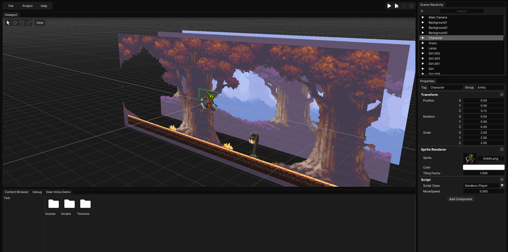

# Locus Game Engine
Locus is a free and open-source game engine aimed to be lightweight and general-purpose.  

### <a href="https://github.com/Kyenel64/Locus-Engine/releases" target="_blank">Download Latest</a> or <a href="Pages/GettingStarted/HowToBuild">Build from Source</a>

The engine is still in development. Progress can be tracked <a href="https://trello.com/b/NNDPkCjF/locus-kanban" target="_blank">here</a>.

## About Locus
The engine is ECS-based with C# scripting, making the workflow familiar and easy to use for many game developers.  
Locus comes with a fully integrated editor with a simple interface to help build games of any genre.

## Locus 2D
Right now, development is focused on the engine's 2D systems. This includes 2D physics, sprite rendering, spritesheets, 2D skeletal animations, etc.
Work on the 3D systems will begin once more of the 2D systems are implemented.

## Contribute
Contribution to the project is always welcome. If you would like to help out or if you found a bug, please submit a pull-request/issue on the <a href="https://github.com/Kyenel64/Locus-Engine" target="_blank">GitHub repository</a>.

## About Me
My name is Kye Nelson and I study Computer Science at the University of Washington. My passion is in computer graphics and game engine development. I currently reside in Japan and I am natively fluent in both English and Japanese.  
You can find me on <a href="https://www.linkedin.com/in/kye-nelson/" target="_blank">LinkedIn</a> and <a href="https://github.com/Kyenel64" target="_blank">GitHub</a>.